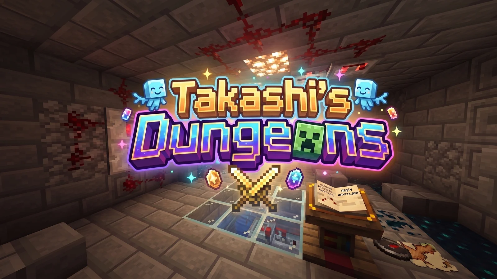
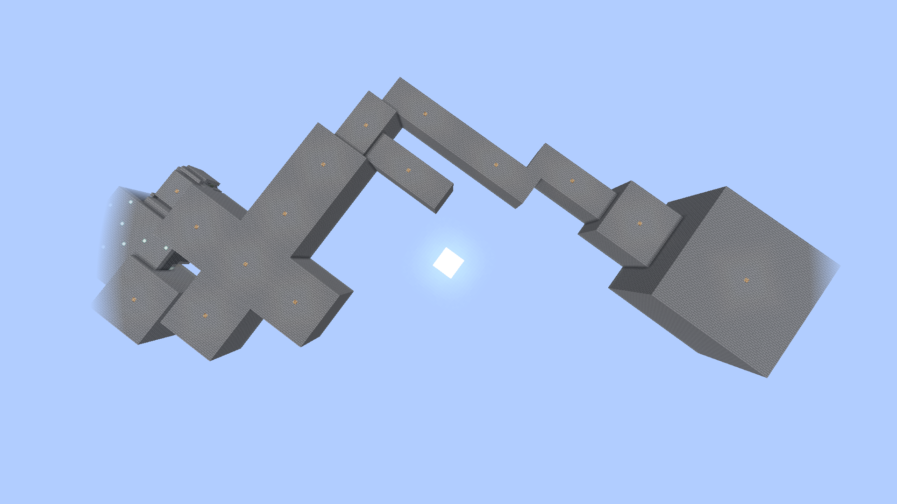
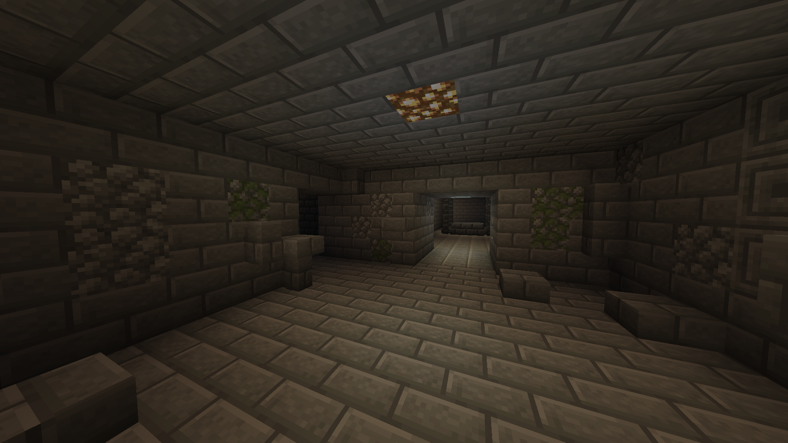

# TakashiDungeons

**Procedural dungeon generation for Paper 1.21.8.** The rooms are hand-built. The layout isn't.




Most "random dungeon" plugins generate the *rooms* procedurally — cellular automata, BSP
splits — and end up with caves or rectangles. This one doesn't generate rooms at all. Rooms
are schematics a map team draws by hand; the engine only decides **which room, where, at what
angle**. That is the same socket/jigsaw approach Mojang uses for villages, bastions, ancient
cities and trial chambers, and it is the only one that lets a 9×25 corridor, a 17×17 hall and
a 33×33 boss arena live in the same dungeon.



*One `medium` dungeon, viewed from outside. Every box is a hand-built schematic; only their
choice, position and rotation are generated.*

Every dungeon lives in its own 512-block slot of a dedicated void world, so two parties never
share geometry.

---

## Where the project is

Phase 1 — the generation core — is finished and verified on a live server. Today you can run
one command and walk through a complete, sealed, connected dungeon:

```
/tdungeons dungeon medium 12345
```



*Ground level: a room, and the corridor through to the next one.*

Same seed, same dungeon, every time. Phase 2 is most of the way there: a generated dungeon is a
tracked instance with a life of its own. It counts down on a boss bar, sends everyone back where
they came from when the time runs out, and deletes itself — blocks included. `/tp` and `/tpa`
do not work inside one, admins excepted.

```
/tdungeons instances
/tdungeons enter <id>
/tdungeons close <id|all>
```

What it does **not** have yet: the entry object players use to get in without an admin command
(phase 2C), and then mobs, loot, parties and persistence.

So: free, open source, and genuinely usable already — if what you want is layout generation.
Wait for phase 2 before putting it in front of players. Issues and questions are welcome
either way; it is being built in public on purpose.

---

## How the layout is built

```
1  pick a room count for the requested size      medium -> 10
2  critical path length = round(count x 0.65)    -> 7
3  chain rooms from the entrance                 single-door templates excluded here
4  grow side branches until count-1 is reached   dead ends welcome
5  attach the boss to the deepest open door      assigned, never rolled
6  plug every door that still opens into the void
```

**The critical path is built first, the boss is assigned last.** If you scatter rooms randomly
and then declare the furthest one to be the boss room, you cannot control how long the dungeon
takes to clear — some runs end in two rooms, some in fifteen. Building the spine first makes
playtime a guarantee and leaves randomness to do what it is good at: variety.

Both halves of that rule were forced by measurement, not taste. Filling every open door
naively only reached the target room count **70.8%** of the time, and 86% of the failures were
not collisions but the door frontier dying out — a Galton-Watson branching process going
extinct because the entrance has one door and the first room drawn was a dead end. Excluding
single-door templates from the path pool alone took that to **97.1%**. And attaching the boss
*before* the side branches meant a `small` dungeon could never actually produce 3 rooms, while
one collision on the 33×33 arena could leave a dungeon with no boss at all — 4 times in 2000
medium runs. Reordering fixed both at once.

Where it lands now, over 3×1000 generations:

| Size | Rooms | Path complete | Room count met | Avg. attempts |
|---|---|---|---|---|
| small | 3–6 | 100% | 100% | 1.17 |
| medium | 7–12 | 100% | 100% | 1.30 |
| large | 13–20 | 99.9% | 100% | 1.64 |

If a generation misses its target it is retried with a fresh seed rather than quietly handed
over short — someone who asked for `medium` should get `medium`.

### Doors are anchors, not declarations

A room's metadata stores the **base-center block of each door opening**, as a local offset
from the room's origin. It does not store which wall the door is on. That is derived from the
anchor vector.

The point is that inconsistency becomes unrepresentable. There is no way to write
`facing: north` next to an anchor sitting in the east wall, because you never write the
facing. It also means a door doesn't have to sit in the middle of a wall, and one wall can
hold several doors.

The full specification — every formula, every measurement, and the reasoning behind each
decision — is in **[docs/generation.md](docs/generation.md)**.

Rotation is computed the same way — never searched:

```
R = (d_parent + 2 - d_child) mod 4
```

The engine doesn't try four angles until one fits. It solves for the angle that makes the two
doorways face each other, then places the room. Y is untouched by the rotation, which makes
multi-storey rooms free.

### Empty doors get plugged, not covered

When the graph runs out of budget, some doors still open into the void. Rather than shipping a
"1-door / 2-door / 3-door" variant of every room — a door *set* defines a variant, not a door
*count*, so that is 15 combinations, not 3 — the engine walls the opening up.

It measures rather than reads. The opening's size is found by scanning air blocks in the wall
plane, so arches, stairs and asymmetric openings all work. The fill material is sampled from
the wall around the opening, so a Nether room plugs itself with nether brick and an End room
with end stone, at zero extra cost to the map team.

---

## Room format

Each `.schem` sits next to a `.yml` of the same name. One file per room, deliberately — a
single central manifest turns every export from a 3-person map team into a merge conflict.

```yaml
# schematics/test_cross.yml
type: normal         # entrance | normal | boss
weight: 100          # this template's share of the candidate draw. Independent of
                     # door count — a 4-door room and a 1-door room each count
                     # their weight once.

doors:               # [x, y, z] anchors, local to the room origin
  - [ 0, 1, -8]      # north wall
  - [ 8, 1,  0]      # east wall
  - [ 0, 1,  8]      # south wall
  - [-8, 1,  0]      # west wall
```

`y: 1` because the anchor is the base block of the opening, one above the room floor. An
upper-storey door on a two-level room is just `[0, 9, -8]` — the scheme doesn't change.

Bad metadata fails loudly at load time, naming the file and the offending line. A silently
defaulted anchor shifts a room by one block, and you only find out by looking at the seam
after the paste.

---

## Building and running

```powershell
powershell -ExecutionPolicy Bypass -File scripts\build.ps1     # compile -> run\plugins\
powershell -ExecutionPolicy Bypass -File scripts\server.ps1    # start Paper 1.21.8
```

JDK 21 is required, and both scripts pin an absolute Temurin 21 path on purpose — Paper 1.21.8
rejects newer JDKs, and resolving `mvn`/`java` from `PATH` is how you end up with a build that
compiles and a server that won't boot.

The `run/` directory is gitignored. To test on a fresh machine you supply:

- `run/paper.jar` — Paper 1.21.8
- `run/plugins/` — **FastAsyncWorldEdit**. Without it the plugin still enables cleanly, but
  generation is disabled.

Nothing else is a hard dependency. WorldEdit/FAWE, MythicMobs and Vault are all `softdepend`;
the plugin is required to load and behave with none of them present.

The rooms shipped in the jar are unpacked into `plugins/TakashiDungeons/schematics/` on enable,
so a fresh install is not an empty folder. A file that already exists is never overwritten —
that folder is also where a mapper exports rooms to, and a bundled room of the same name would
otherwise eat a newer export on every restart. `/tdungeons extract force` overwrites, when you
mean it. Folder structure is preserved, so a bundled theme is just a subfolder under
`src/main/resources/schematics/`.

**The bundled set is still three entrance rooms.** The mechanism is done; the room library is
not, so a clean install cannot generate a full dungeon yet.

---

## Tests that don't need a server

The `generation` package is deliberately pure Java — no Bukkit types, no WorldEdit types — so
the placement mathematics can be tested offline, in seconds:

```powershell
powershell -ExecutionPolicy Bypass -File scripts\geo-probe\run.ps1
```

**112 checks**, split across geometry (53), candidate selection and collision (28), and graph
generation (31). They cover rotation round-trips, wall derivation on square, rectangular and
asymmetric rooms, weight distribution over 200,000 draws, dead-door marking, seed
reproducibility, plug coverage, and the out-of-box fallbacks — generating with no boss room,
no entrance room, no rooms at all, and only single-door rooms.

The probes hold their room set in the same alphabetical order the server does, so they predict
exactly what the server will build. That is how the expected block coordinates for the live
`execute if block` checks were derived: an offline calculation matching server output block
for block is end-to-end proof that generation is reproducible.

One of those probes exists because of a bug worth repeating. `new Random(seed)` is an LCG
whose first output is a direct function of the seed's high bits, so across **consecutive**
seeds it barely varies:

```
new Random(seed).nextInt(4), seed = 1..40:
  2 2 2 2 2 2 2 2 2 2 2 2 2 2 2 2 2 2 2 2 2 2 2 2 2 2 2 2 2 2 2 2 2 2 2 2 2 2 2 2

4000 consecutive seeds:  [0, 0, 1857, 2143]   <- 0 and 1 never appear
```

Instance IDs and `currentTimeMillis()` are both consecutive, and both are the natural thing to
seed with later on. Every `small` dungeon would have come out the same size, and nothing would
have thrown — the variety would just have quietly disappeared. `generation/Seeds.java` now
runs seeds through splitmix64 into a `SplittableRandom`; reproducibility is unaffected. The
probe proves the correlation exists *before* proving the mixer removes it.

---

## Configuration

`config.yml`, fully commented. The knobs that matter:

| Key | Default | What it does |
|---|---|---|
| `dungeon-world.slot-size` | `512` | Edge of one instance's square. Must exceed your largest dungeon, or instances bleed into each other. |
| `dungeon-world.columns` | `32` | Slots per grid row. 512 × 32 = 16,384 blocks along X. |
| `generation.turn-bias` | `2.0` | Pushes back door choices that continue straight, so chains don't come out ruler-straight. `1.0` disables it. |
| `generation.max-attempts` | `8` | Retries before falling back to the best attempt and reporting a warning. |
| `generation.plug-open-doors` | `true` | Turn off to see exactly where the graph choked. |
| `schematics.extract-bundled` | `true` | Unpack the jar's rooms into the schematics folder. Off means a clean install has no rooms at all. |
| `hud.lines` | 6 lines | The sidebar layout, as MiniMessage. Placeholders: `<player> <coin> <xp> <rank> <server> <ip>`. |
| `hud.show-by-default` | `true` | Whether the sidebar is on when a player joins. Each player can flip it with `/hud`. |

YAML first, GUI editors later. A config that only works through a GUI is a config you cannot
diff, template, or ship a preset for.

---

## Commands

All under `/tdungeons` (aliases `/td`, `/takashidungeons`), permission `takashidungeons.admin`.

| Command | |
|---|---|
| `dungeon <small\|medium\|large> [seed]` | Generate a full dungeon |
| `rooms` / `room <name>` | List templates / inspect one's doors, box and metadata |
| `weights` | Show the candidate draw distribution |
| `gen` | Write out the code-generated placeholder rooms |
| `paste <name> [rot]` / `connect` | Placement primitives, for checking geometry by eye |
| `slots` / `free <index>` | Instance slot grid |
| `world` / `list` / `status` / `version` | Diagnostics |
| `hud [name\|ip] <text>` | Read the sidebar settings, or write the server name / IP into `config.yml` |
| `extract [force]` | Unpack the rooms bundled in the jar again; `force` overwrites what is on disk |

And one command for everyone, permission `takashidungeons.hud` (default: on):

| Command | |
|---|---|
| `/hud [on\|off]` | Toggle your own sidebar (aliases `/tdhud`, `/dhud`) |

The sidebar shows the server name, the player's name, their coin, their rank and XP, and the
server IP. Coin, rank and XP read `-` until the economy (phase 7) and rank (phase 11) systems
exist — a `0` there would read as a real balance. Whether a player has it open is kept for the
session only; making it stick needs the SQL layer, and player data does not go into YAML.

---

## Roadmap

Phase 0 (setup) and phase 1 (generation core) are done. The rule for the rest is that a phase
ships **working** before the next one starts.

- **2 — Instance lifecycle** *(next)* — cleanup, timers, entry object, `/tp` blocking
- **3 — Mobs** — `MobProvider` abstraction, vanilla fallback, MythicMobs integration, classes and difficulty
- **4 — Loot** — rarity classes, weighted selection, chest filling, drop tables
- **5 — Parties**
- **6 — Supply mob** — optional pre-run shop
- **7 — Database** — SQLite by default, MySQL optional, async access
- **8 — Public API** — events and interfaces for addons, frozen against breaking changes
- **9 — GUI editors**
- **10 — Map building** — 4 biomes × 10 room types, running in parallel with the above

Two addons will ship separately against that public API, both free: **TakashiRanks** (XP and
ranks) and **TakashiMarket** (currency and shop). The core is required to be fully functional
without either.

---

## Architectural rules

A few decisions are settled and not up for revisiting, because everything else is built on
them:

- **Instanced only.** No permanent writes to a live world.
- **Player data lives in SQL.** Never YAML, never flat files.
- **No hard dependency on any mob plugin.** The vanilla fallback always works.
- **Mob spawning always carries a `statOverride` flag**, so a custom mob's own stat system is
  never silently overwritten.
- **No breaking changes in the public API** once it exists — addons depend on it.
- **`/tp` and `/tpa` do not work inside a dungeon.** Admins are the exception.

---

## License

**GPLv3** — see [LICENSE](LICENSE). Copyright (C) 2026 Onur Sessiz.

Free to use on any server, public or private, commercial or not. Free to fork, modify and
learn from. The one condition GPL adds: if you distribute a modified version, you publish
your source under the same license. Build on it in the open, not on top of it in the dark.

The addons listed in the roadmap will carry the same license.
